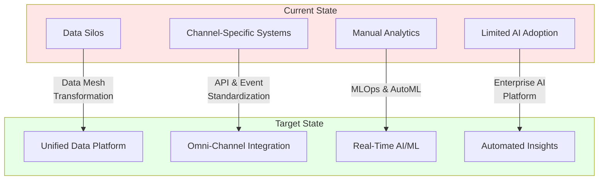
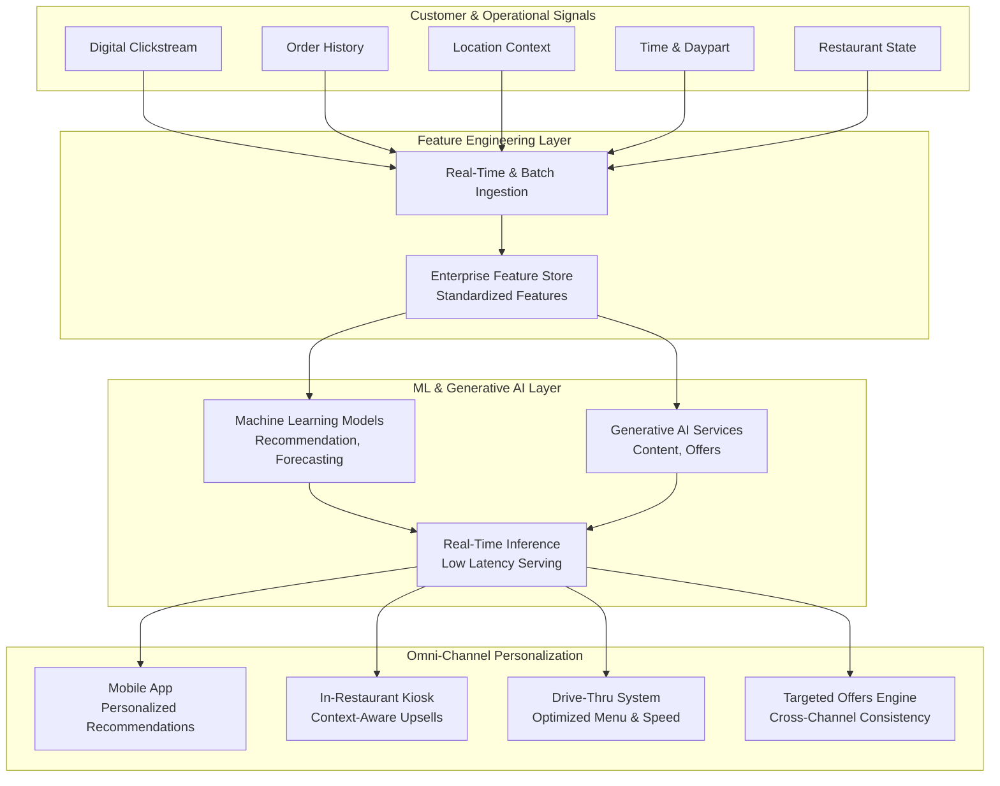
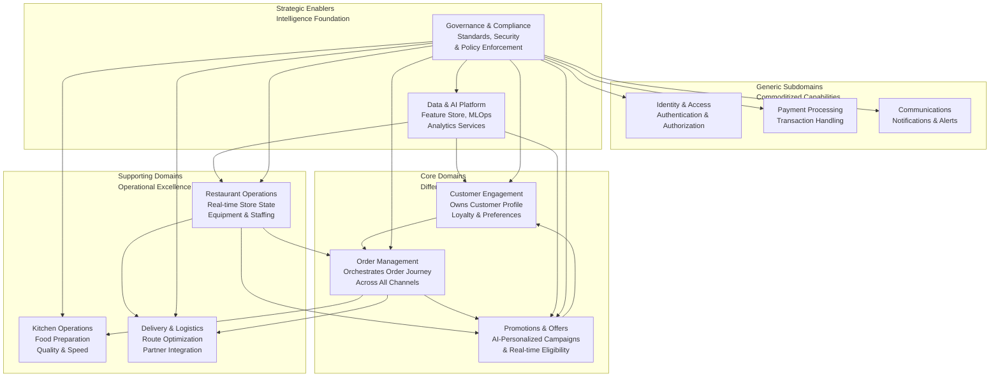
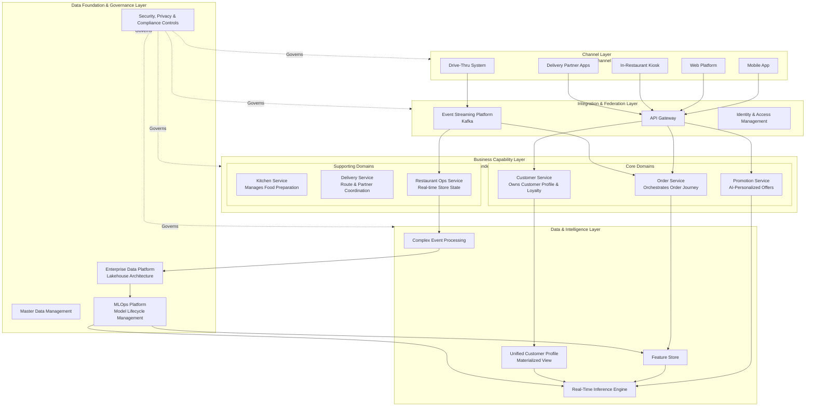
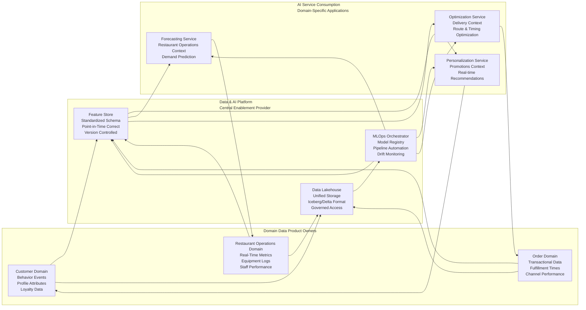

# The Golden Arches Intelligence Core: A Domain-Driven Enterprise Architecture for McDonald's Omni-Channel & AI Future

## 1. Executive Summary & Vision Statement
#### <ins>Vision</ins>: To enable a globally consistent, locally adaptable, and real-time data and AI ecosystem that powers exceptional consumer experiences, optimized restaurant operations, and data-driven enterprise decision-making for 65M+ daily customers.

#### <ins>Strategic Alignment</ins>: This architecture directly enables the Accelerating the Arches strategy by providing the foundational technology capabilities to Double Down on the 3Ds (Delivery, Digital, and Drive-Thru). It transforms McDonald's from a collection of channel-specific systems into a unified, intelligent enterpries.

#### Core Architectural Mantra: "Omni-channel is not a channel problem, it is a data, integration, and intelligence problem."

> [!IMPORTANT]
> <ins>Architectural Perspective Disclaimer</ins>: The enterprise architecture perspectives, capability models, technology recommendations, and transformation roadmaps presented in this document represent preliminary architectural viewpoints developed from an Enterprise Architect's professional analysis. They serve as a structured starting point for discussion and collaborative design—not as a finalized, mandated plan.
> 
> <ins>Basis of Perspective</ins>:
> 
> This analysis is founded on:
> 
> 1. A technical review of McDonald's public strategic disclosures (Accelerating the Arches), the Global Technology Technical Blog, and stated capability needs.
> 2. The application of industry-standard architecture frameworks (TOGAF, ArchiMate) and patterns (Domain-Driven Design, Data Mesh) to McDonald's specific global-enterprise context.
> 3. Professional judgment regarding scalable, sustainable, and secure designs for omni-channel data and AI platforms.
>    
> <ins>Path to Realized Value</ins>: 
> The true strategic value of enterprise architecture is realized not in documents, but in execution. This perspective will be validated and refined through:
> 
> (i) <ins>Collaborative Refinements</ins>: Extensive workshops and reviews with technical teams (Global Technology, product engineering, data science) and business stakeholders (marketing, operations, finance, restaurant teams; etc).
> 
> (ii) <ins>Iterative Validation</ins>: Testing architectural hypotheses through targeted prototypes, proof-of-concepts, and pilot implementations in selected markets or domains.
> 
> (iii) <ins>Adaptive Evolution</ins>: Incorporating lessons learned from implementation, changes in the technology landscape, and evolving business strategy into a living architecture.
>
> Final decisions on methodology, implementation sequencing, technology selection, and detailed scheduling will be made collectively through a comprehensive stakeholder engagement process.
>

---

## 2. Foundational Architecture Principles & Concepts
### 2.1 Domain-Driven Design (DDD) as the Cornerstone
DDD is not merely a technical choice; it is an organizational imperative for a global, distributed enterprise like McDonald's. It ensures that software/AI/data architecture mirrors day-to-day business realities

- Bounded Contexts: Explicitly defined boundaries where a particular domain model, with its precise Ubiquitous Language applied. This prevents the fatal conflation of terms like "Order" (Customer Context) with "Ticket" (Kitchen Context) or "Invoice" (Finance Context).

- Ubiquitous Language: A shared, rigorous vocabulary used consistently by both business stakeholders and technologists within a bounded context. This eliminates ambiguity and accelerates development.

- Context Mapping: The strategic view of how bounded contexts interact. We employ:

  - <ins>Partnerships</ins> (e.g., Order Management & Payment Processing)

  - <ins>Customer-Supplier</ins> (e.g., Customer Profile supplies data to Personalization Engine)

  - <ins>Conformist</ins> (with external Delivery Partner contexts)

  - <ins>Anti-Corruption Layers</ins> (ACLs) to isolate core domains from external or legacy subsystems
 
---

## 2.2 Supporting Architectural Styles & Patterns

- <ins>Microservices</ins>: The deployment and runtime manifestation of a Bounded Context. Each domain capability is realized as an independently deployable service. Interested readers may wish to see an example of microservices implementation that features Kafka topics as services on Kubernetes (Kind) platform here:  https://github.com/manuelbomi/Apache-Kafka-Enterprise-Microservices-Platform-on-Kubernetes 

- <ins>Event-Driven Architecture (EDA)</ins>: The primary mechanism for Context Mapping and achieving real-time omni-channel awareness. Events like OrderPlaced or CustomerIdentifiedAtDriveThru propagate state changes across the ecosystem.

- <ins>API-First Design</ins>: All service interactions, both internal and external (e.g., delivery partners), are governed by well-defined, versioned REST/GraphQL APIs.

- <ins>Layered Architecture with a Clear Separation of Concerns</ins>: Distinguishes between Channel, Integration, Intelligence (Business Logic), and Data layers to manage complexity.



*Figure 1: McDonald's current and target AI/Data capability landscape*

---

## 3. Omni-Channel Data Flow & AI Personalization

*This flowchart details the real-time AI personalization pipeline that transforms diverse customer and operational signals into intelligent, channel-specific customer experiences. Raw data from digital clickstreams, order history, location context, time/daypart patterns, and real-time restaurant state flows through the Feature Engineering Layer, where it is standardized in the Enterprise Feature Store. The ML & Generative AI Layer then processes these features through recommendation/forecasting models and generative AI services, with real-time inference serving personalized outputs to each customer touchpoint—including mobile app recommendations, kiosk upsells, drive-thru optimizations, and cross-channel targeted offers—creating a cohesive, intelligent omni-channel journey.*


Figure 2: Omni-Channel Personalization Pipeline - From Raw Signals to Channel-Specific Actions


---

## 4. The Domain Landscape: Bounded Contexts for McDonald's

Based on the McDonald's current and future capabilities, here is a  proposed domain decomposition using DDD principles:

> [!NOTE]
> Interested readers may want to check about conceptual McDonald's current and target capabilities here: https://github.com/manuelbomi/Enterprise-Architecture-for-McDonald-s-AI-Data-Driven-Transformation-An-Architect-s-Strategic-Bluepr
>
> 



*Figure 3: Domain Landscape - Bounded Contexts Mapping* 

*This context map organizes McDonald's business capabilities into four domain categories using Domain-Driven Design principles. Core Domains represent differentiating capabilities, Supporting Domains enable operational excellence, Generic Subdomains provide commoditized functions, and Strategic Enablers deliver shared intelligence infrastructure, with Governance providing cross-domain standards.*


---

#### Key Domain Contexts & Their Responsibilities:

- <ins>Customer Engagement Context</ins>: Owns the Customer Profile, loyalty status, and preference history. Publishes CustomerBehaviorUpdated events.

- <ins>Order Management Context</ins>: The system of record for the customer's order journey. Orchestrates fulfillment across channels. Publishes OrderPlaced, OrderStatusChanged events.

-  <ins>Promotions & Offers Context</ins>: Manages campaign rules, eligibility, and AI-driven personalization logic. Consumes customer and context data to publish PersonalizedOfferGenerated events.

-  <ins>Restaurant Operations Context</ins>: Owns real-time store state (inventory, equipment health, crew staffing). Publishes DriveThruQueueUpdated, InventoryLow events.

-  <ins>Data & AI Platform Context</ins>: A Supporting Subdomain that provides data products (feature stores, trained models, analytics) as reusable services to all other domains. It does not own business logic.

---

## 5. Target State Architecture Blueprint

This diagram synthesizes the Omni-Channel view with the Domain-Driven decomposition and the layered principle.



*Figure 4: Target State Architectuer Blueprint - Layered Omni-Channel Ecosystem*

*This diagram illustrates the five-layer target architecture for McDonald's global omni-channel ecosystem. The Channel Layer represents customer touchpoints, which connect through the Integration Layer to Business Capability Layer microservices organized by Domain-Driven Design bounded contexts. The Data & Intelligence Layer provides shared AI/ML capabilities, all supported by the foundational Data Foundation & Governance Layer with cross-cutting security and compliance controls.*

---

## 6. AI & Data Mesh Implementation View

To enable "AI-powered personalization at global scale," we adopt a hybrid data mesh approach. The Data & AI Platform Context acts as the central enablement platform, while each domain owns its domain-oriented data products.


*Figure 5: AI & Data Mesh Implementation - Federated Data Products*

*This diagram depicts the hybrid data mesh implementation where domain teams own their data products while consuming centralized platform services. Domain Data Product Owners publish to the Data & AI Platform, which provides standardized Feature Stores, MLOps orchestration, and unified storage, enabling AI services to deliver intelligence back to the consuming domains.*

#### Key AI Use Cases Mapped to Architecture:

- <ins>Drive-Thru Menu Optimization</ins>: Restaurant Ops Context (local traffic, time) + Customer Context (local preferences) → Real-Time Inference Engine → Suggestion to Drive-Thru System.

- <ins>Cross-Channel Personalization</ins>: Customer Profile (Materialized View) + Order History (Event Stream) → Feature Store → Promotion Service → PersonalizedOfferGenerated event consumed by all Channel Layer systems.

---

## 7. Standards, Governance & OKRs

#### 7.1 Critical Architecture Standards

- <ins>Event Standardization</ins>: All domain events must conform to a global schema registry (e.g., Apache Avro/Protobuf) with mandatory fields (eventId, timestamp, sourceContext, payload).

- <ins>API Standards</ins>: RESTful APIs must follow McDonald's API Design Handbook, include versioning in the URL path, and provide OpenAPI 3.0 specifications.

- <ins>Data Product Contract</ins>: A domain's data product must have a clear SLO for freshness, quality, and schema stability.

---

#### 7.2 Key Results (KR) for EA Practice

- <ins>KR1: Reduce Time-to-Insight</ins>: Increase the percentage of key business decisions supported by real-time data (from <10% to >40% in 18 months).

- <ins>KR2: Increase Capability Reuse</ins>: Achieve >70% reuse of core data products (e.g., Unified Customer Profile) across all new channel initiatives.

- <ins>KR3: Improve Development Velocity</ins>: Reduce the integration time for a new channel (e.g., a new delivery partner) from months to under 4 weeks through standardized APIs and event contracts.

- <ins>KR4: Ensure Responsible AI</ins>: 100% of production AI models are versioned, monitored for drift, and have documented bias assessments via the centralized MLOps platform.

---

## 8. Roadmap & Evolution

#### Phase 1: Foundation & Consolidation (Next 12 Months)

- Establish the Event Streaming backbone and API Gateway.

- Implement the Customer Engagement and Order Management bounded contexts as first-class microservices.

- Stand up the foundational Feature Store and initial data product from the Customer domain.

#### Phase 2: Intelligence & Scale (12-24 Months)

- Roll out the Promotions & Offers context with integrated AI inference.

- Implement real-time Restaurant Operations context for Drive-Thru optimization.

- Establish full MLOps lifecycle and expand the Data Mesh.

#### Phase 3: Autonomy & Ecosystem (24-36 Months)

- Enable fully decentralized domain data product ownership.

- Open strategic internal capabilities as external APIs for partner innovation.

- Evolve towards predictive and autonomous restaurant operations.

---

## Conclusion: 

This Domain-Driven Enterprise Architecture provides a conceptual but coherent, strategic blueprint required to transform McDonald's Global Technology. It aligns technology directly with business capabilities, empowers distributed teams, and creates the scalable, intelligent foundation necessary to power tomorrow's feel-good moments, one perfectly architected interaction at a time.

---


### Thank you for reading
---

### **AUTHOR'S BACKGROUND**
### Author's Name:  Emmanuel Oyekanlu
```
Skillset:   I have experience spanning several years in data science, developing scalable enterprise data pipelines,
enterprise solution architecture, architecting enterprise systems data and AI applications,
software and AI solution design and deployments, data engineering, high performance computing (GPU, CUDA), machine learning,
NLP, Agentic-AI and LLM applications as well as deploying scalable solutions (apps) on-prem and in the cloud.

I can be reached through: manuelbomi@yahoo.com

Website:  http://emmanueloyekanlu.com/
Publications:  https://scholar.google.com/citations?user=S-jTMfkAAAAJ&hl=en
LinkedIn:  https://www.linkedin.com/in/emmanuel-oyekanlu-6ba98616
Github:  https://github.com/manuelbomi

```
[](https://skillicons.dev)


